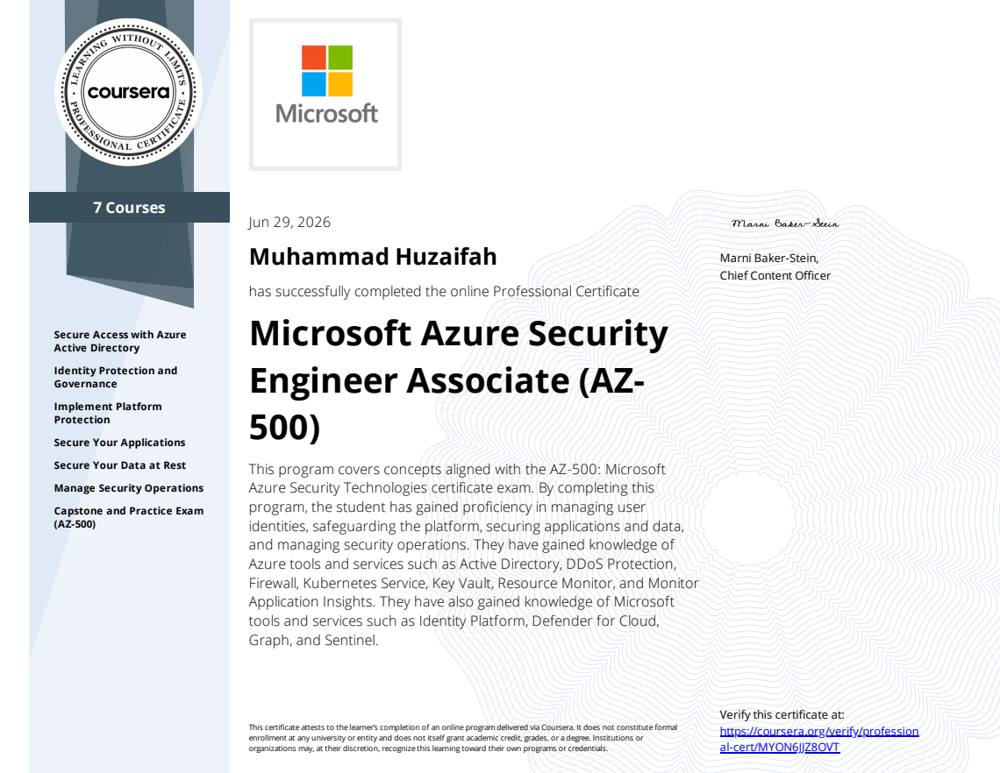

# Azure Security Engineer Associate (AZ-500) Professional Certificate Projects/Labs

This repository documents the hands-on labs completed as part of the Microsoft Azure Security Engineer Associate (AZ-500) Professional Certificate.

The purpose of this repository is to demonstrate practical experience with securing cloud infrastructure, identities, applications, and data within Microsoft Azure. Each lab focuses on implementing security controls, monitoring resources, and applying industry best practices in a controlled cloud environment.

--- 

## Projects/Labs

### Project from Course 1: Secure Access with Azure Active Directory

Implemented Azure Active Directory security controls by:
 - Managing users and groups
 - Enabling Self-Service Password Reset (SSPR)
 - Configuring Multifactor Authentication (MFA) to enhance identity security

**[Click to view lab instructions & solution](https://github.com/huzaifah-cyber/Azure-Security-Engineer/tree/main/Project%20Course%201)**

### Project from Course 2: Identity Protection and Governance 

Implemented Azure security and governance controls by:
- Configuring Azure Active Directory Privileged Identity Management (PIM)
- Blocking access by location using Conditional Access
- Creating access reviews for privileged roles
- Assigning Azure roles to groups using RBAC
- Enabling resource locks to protect Azure resources from accidental deletion

**[Click to view lab instructions & solution](https://github.com/huzaifah-cyber/Azure-Security-Engineer/tree/main/Project%20Course%202)**

### Project from Course 3: Implement Platform Protection

Strengthened Azure network security boundaries and access controls by:
 - Hardening perimeter security using Network Security Groups (NSGs) to strictly control inbound traffic flow with precise rule prioritization.
 - Securing administrative access by isolating port 3389 to allow authorized Remote Desktop Protocol (RDP) management sessions into the virtual machine.
 - Enforcing zero-trust network isolation during the baseline installation of Internet Information Services (IIS) before exposing the server to the         internet.
 - Validating firewall integrity by testing the public IP address to confirm that unauthorized external traffic was successfully blocked by default.
 - Managing the public attack surface by creating a dedicated inbound rule on port 80 to securely permit web traffic to the application.
 - Conducting end-to-end connectivity audits to verify that public web services were fully accessible only after the correct security policies were         applied.

**[Click to view lab instructions & solution](https://github.com/huzaifah-cyber/Azure-Security-Engineer/tree/main/Project%20Course%203)**

### Project from Course 4: Secure Your Applications

Implemented Azure application security and secret management controls by:
- Creating and configuring Azure Key Vault to securely store sensitive application credentials and secrets instead of exposing passwords directly during resource deployment.
- Managing Key Vault secrets and cryptographic keys to protect application artifacts and support secure access patterns.
- Deploying a DevTest Lab environment and integrating Key Vault secrets during virtual machine creation to demonstrate secure credential handling and reduce the risk of password exposure.
- Creating and managing virtual machine resources through DevTest Lab while applying secure secret retrieval practices during deployment.
- Generating and managing encryption keys within Azure Key Vault to strengthen data protection and support secure key lifecycle management.
- Configuring Microsoft Graph Explorer permissions and executing Graph API queries to retrieve identity and security-related information from Microsoft Entra ID.
- Using Microsoft Graph to audit organizational security data, including guest users, security alerts, high-severity alerts, department users, and registered devices.
- Applying cloud security best practices by combining centralized secret management, identity-based access, and API-driven security auditing.

**[Click to view lab instructions & solution](https://github.com/huzaifah-cyber/Azure-Security-Engineer/tree/main/Project%20Course%204)**

### Project from Course 5: Secure Your Data at Rest

Implemented Azure data protection and monitoring controls by:
- Securing Azure Blob Storage resources by creating storage accounts with geo-redundant storage and configuring container access controls.
- Implementing Shared Access Signature (SAS) tokens to provide limited, time-bound access to storage resources while following the principle of least privilege.
- Using Azure Storage Explorer to securely connect and validate access to Blob Storage using SAS-based authentication.
- Deploying Azure Database for MySQL Flexible Server and configuring secure database deployment settings.
- Protecting database encryption keys by creating an Azure Key Vault and configuring a user-assigned managed identity with controlled key permissions.
- Implementing customer-managed keys (CMK) for database encryption to maintain greater control over data protection and encryption key management.
- Validating encryption during database restoration by restoring the MySQL server while maintaining customer-managed key protection.
- Configuring MySQL audit logging to monitor connection and general database activities for accountability and security monitoring.

**[Click to view lab instructions & solution](https://github.com/huzaifah-cyber/Azure-Security-Engineer/tree/main/Project%20Course%205)**

### Project from Course 6: Manage Security Operations

Implemented Azure security monitoring and threat detection capabilities by:
- Deploying the Log4j Vulnerability Detection solution through Microsoft Sentinel Content Hub to enable proactive identification of Log4j exploitation attempts.
- Configuring Microsoft Sentinel analytics rules from templates to detect Log4Shell-related indicators of compromise (IOC) within the environment.
- Creating and configuring scheduled analytics rules with custom alert formatting, entities, and automation settings to improve incident investigation and response workflows.
- Implementing Azure Monitor alerting capabilities to monitor virtual machine availability and detect service interruptions.
- Creating action groups to enable proactive notifications when critical VM availability conditions are detected.
- Applying cloud security monitoring practices by combining SIEM-based threat detection with Azure resource monitoring and automated alerting.

**[Click to view lab instructions & solution](https://github.com/huzaifah-cyber/Azure-Security-Engineer/tree/main/Project%20Course%206)**

### Project from Course 7: Capstone and Practice Exam (AZ-500)

Implemented a multi-layer Azure security architecture to protect sensitive business data by:
- Creating and managing Azure AD users and groups while applying identity security controls through mandatory multifactor authentication (MFA).
- Implementing Azure RBAC by assigning the Virtual Machine Administrator Login role and Storage Blob Data Contributor permissions to authorized users through group-based access management.
- Securing confidential files using Azure Blob Storage by creating containers, uploading protected content, and generating controlled Blob SAS access URLs.
- Applying the principle of least privilege by providing time-bound and permission-based access to storage resources using SAS authentication.
- Protecting storage encryption keys by creating Azure Key Vault resources, managed identities, and customer-managed keys (CMK) for enhanced encryption control.
- Encrypting Azure Storage accounts with customer-managed keys to improve data protection and maintain control over encryption key lifecycle management.
- Strengthening storage security by enabling Microsoft Defender for Storage to detect potential threats and suspicious activities.
- Configuring diagnostic settings to send storage activity logs to Log Analytics for monitoring, visibility, and security investigation.
- Securing virtual machine access by creating network security group rules and controlling inbound Remote Desktop Protocol (RDP) traffic.
- Validating secure access workflows by testing Blob SAS-based image access through administrator and authorized sales team accounts.

**[Click to view lab instructions & solution](https://github.com/huzaifah-cyber/Azure-Security-Engineer/tree/main/Project%20Course%207%20(Capstone))**
